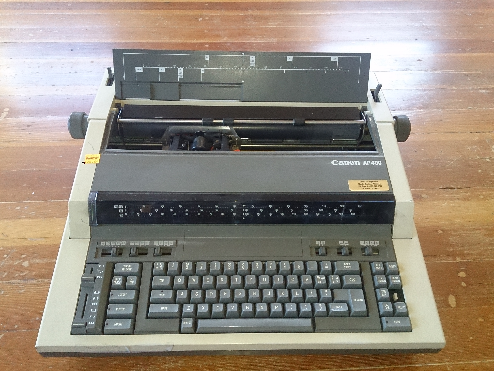
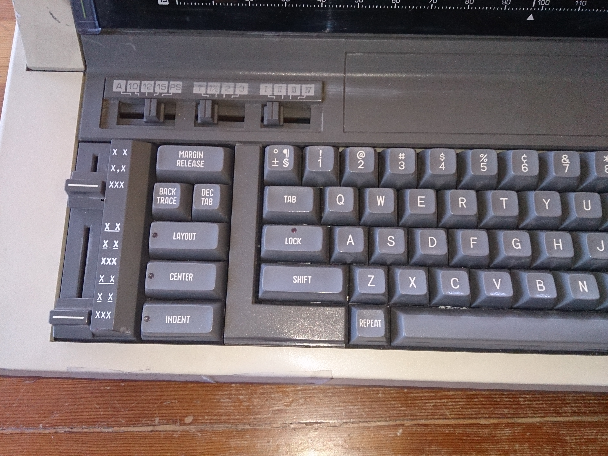
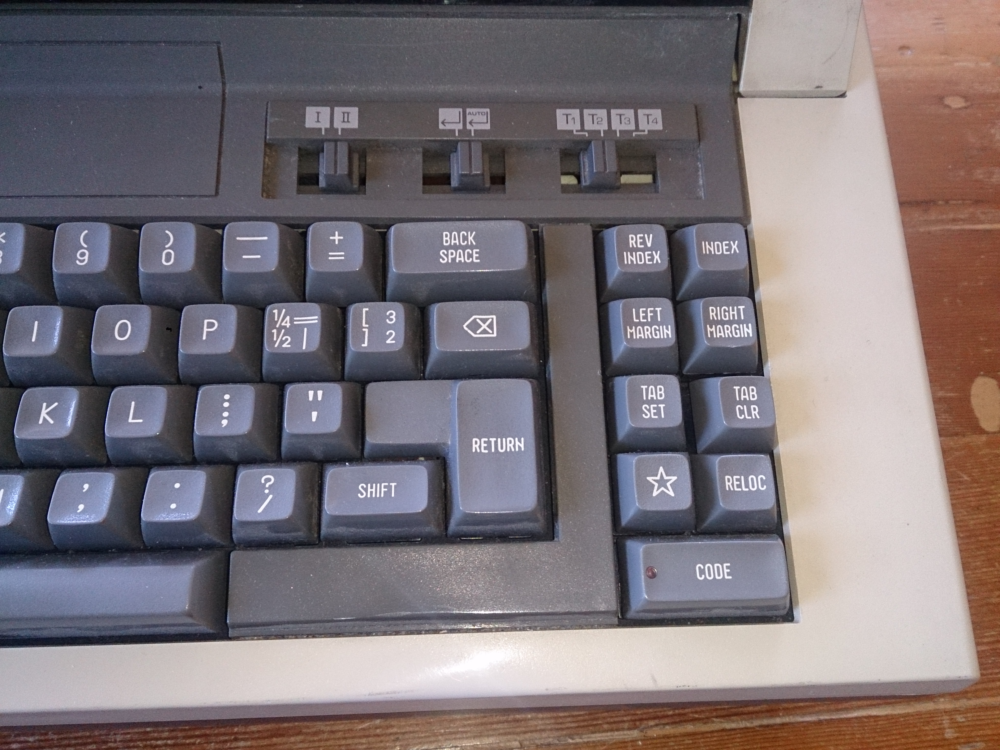
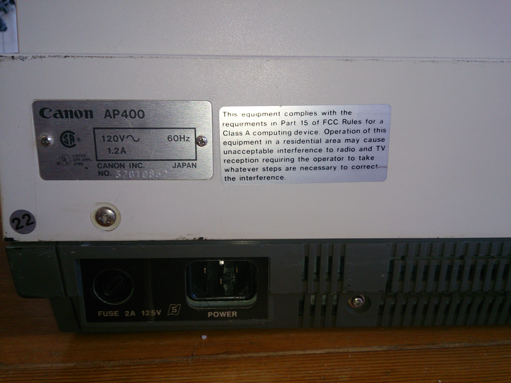
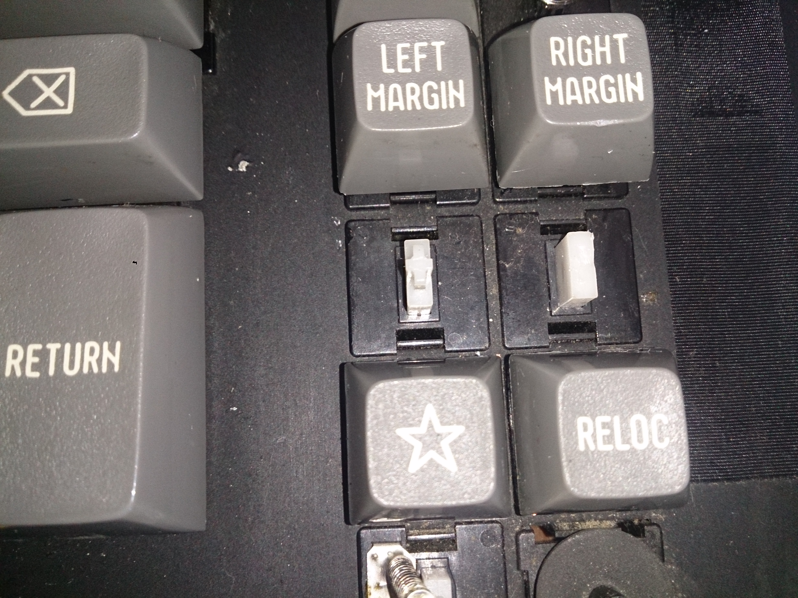
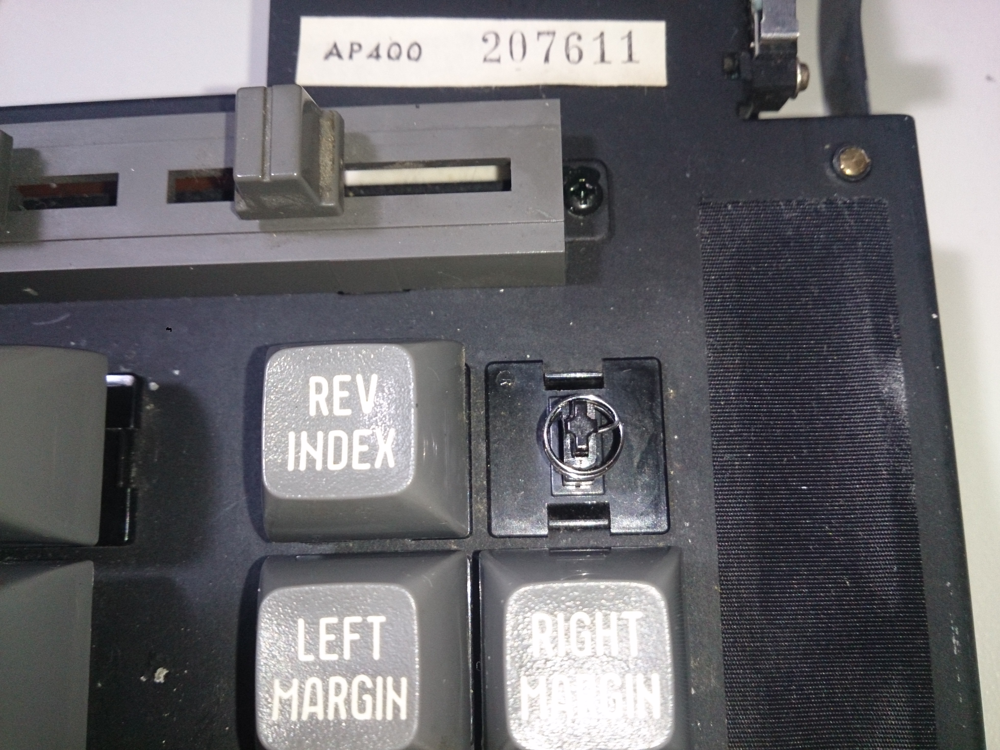
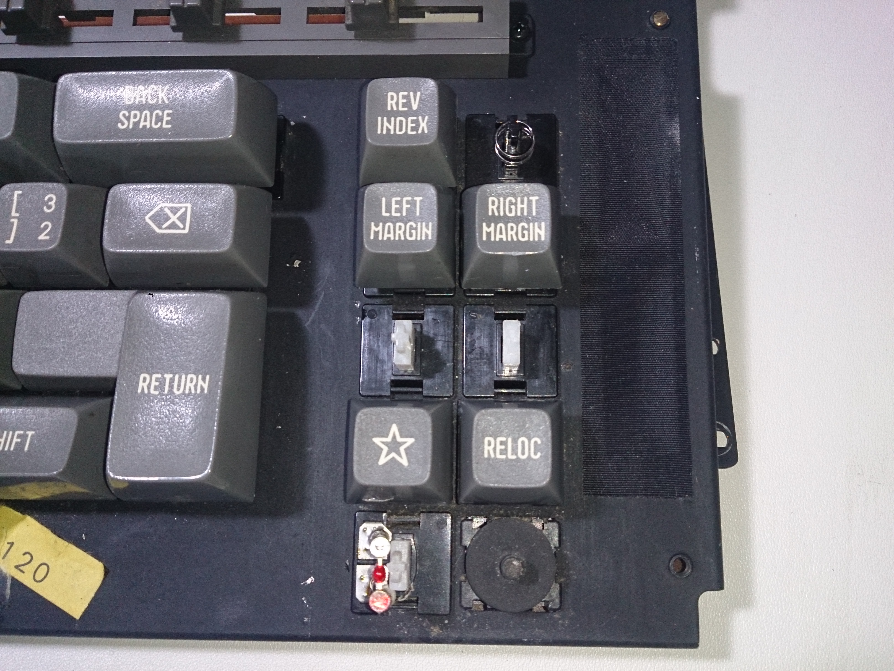
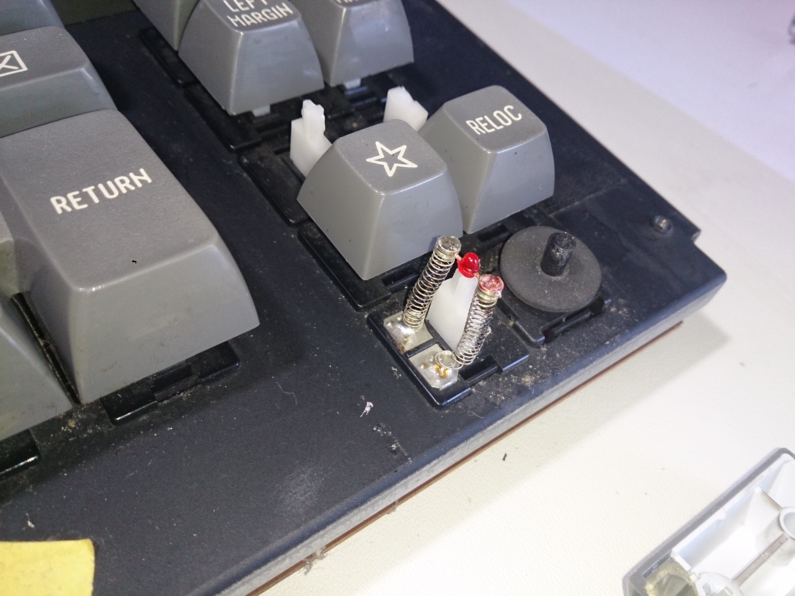
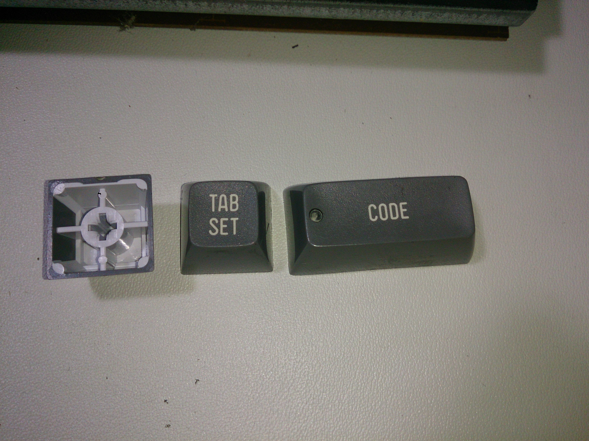
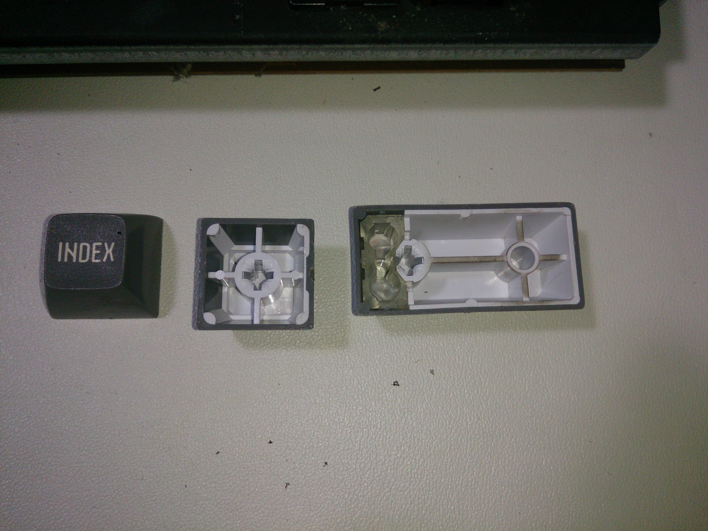

# AP 400

[Back to 4xx Series](../README.md)

[Back to index](../../README.md)

__Tag on back__

- AP400

__Switches__ 

- SKFF

__Lock Light__

- Round centered on Caps Lock
- Round centered on function keys

__Keycaps__

- White on gray Spherical Doubleshot

__Screen__

- None

__Notes__

```
The Canon AP400 typewriter in which it was discovered bears the Alps keyboard codes 12KF006C and KFFBA010; from this, (S)KFF was deduced. The Apple III service manual was subsequently found to cite these switches as "KFF". However, they remain listed here as SKFF until Alps's apparent inconsistent naming is better understood.
```
[Source](https://deskthority.net/viewtopic.php?f=8&t=6707&start=)
[Source](https://www.flickr.com/photos/triplehaata/10391719074/)

__Pictures__











