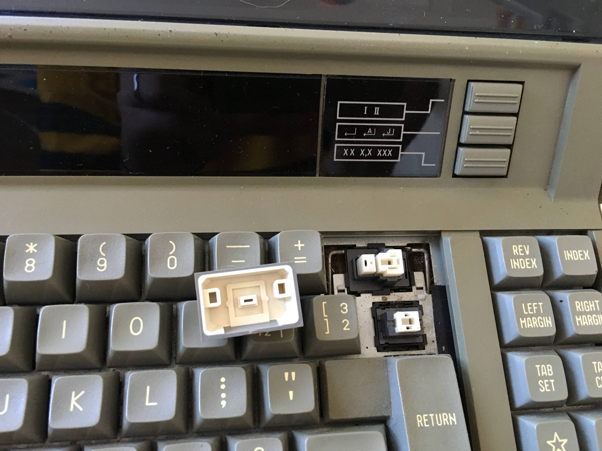

# AP 500 II

[Back to 5xx Series](../README.md)

[Back to index](../../README.md)

__Tag on back__

AP 500-II

__Switches__ 

- Alps SKCP + SKCL Green & SKCL Double action

__Lock Light__

- Square centered on Caps Lock
- Square centered on function keys

__Keycaps__

Spherical Doubleshot

__Screen__

__Notes__

```
A slightly later model, the AP500-II, from ~1985, used the horizontal type of Alps plate spring switches.

I was expecting SKCM "ivory" switches, as that’s what the ~1986–1987 versions of these typewriters had, but this version turns out to have plate-mounted Alps plate spring switches throughout the main section, with double-acting plate spring switches on the spacebar, return, and back space keys, and a mix of SKCL green and double-acting SKCL switches on the lock key and on the side function keys.

That explains why the later typewriters used a mix of SKCM and double-acting plate spring switches. I assume the switch from plate spring to SKCM was for cost cutting, but maybe someone at Canon or Alps just preferred them.

Keycaps are spherical, mostly doubleshot, with pad printed legends on all the window keys (except the lock key). They were originally white on gray, but now are yellow on brown.
```
[Source](https://deskthority.net/viewtopic.php?p=297498#p297498)

__Pictures__





